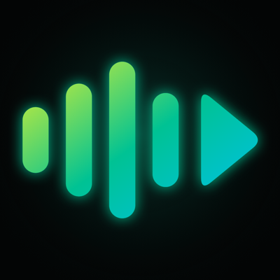
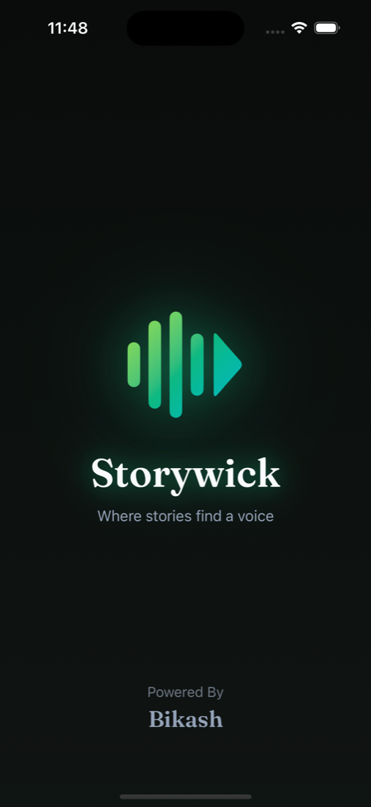
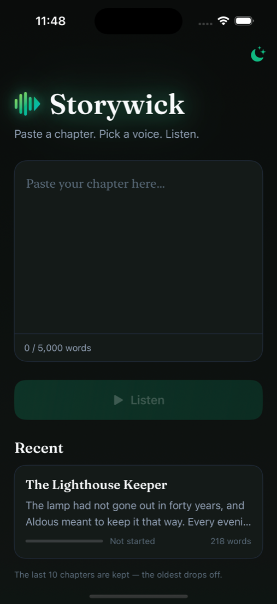
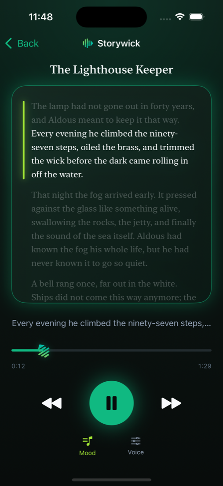
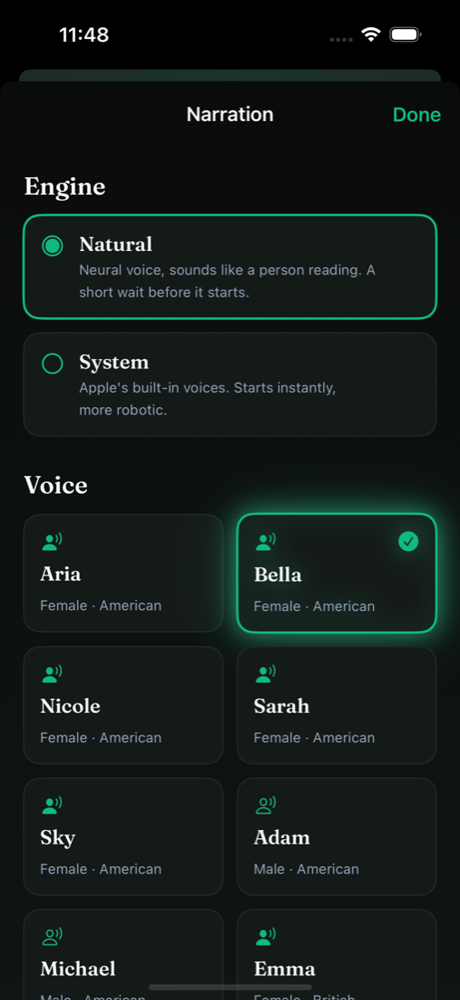
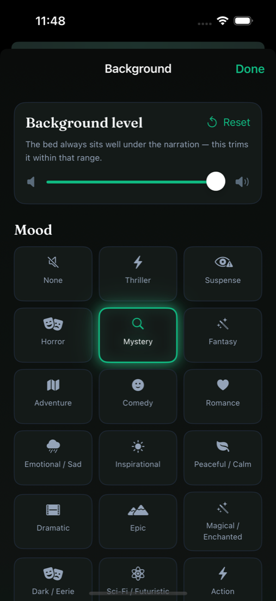

<div align="center">



# Storywick

**_Where stories find a voice._**

A private, fully-offline iOS app that reads your pasted novel chapters aloud in a
natural neural voice — with cinematic mood music playing softly underneath, and a
player that behaves like Apple Music.

Personal project. Not on the App Store. Runs on the simulator and on a personal
iPhone via a free Apple ID.

</div>

---

## Screenshots

<table>
  <tr>
    <td align="center" width="33%"><br /><sub>Branded splash</sub></td>
    <td align="center" width="33%"><br /><sub>Paste · pick a voice · listen</sub></td>
    <td align="center" width="33%"><br /><sub>Now-Playing reader</sub></td>
  </tr>
  <tr>
    <td align="center"><br /><sub>11 neural voices + a system fallback</sub></td>
    <td align="center"><br /><sub>25 mood beds, tucked under the voice</sub></td>
    <td></td>
  </tr>
</table>

---

## What it does

Storywick turns a chapter of text into something you can put on and listen to
like an audiobook — but generated on your phone, from any book you're reading.

- **Paste a chapter** (up to 5,000 words) into the one screen there is. No
  library to manage, no files to import.
- **It reads it in a real-sounding voice.** The default engine is a small neural
  text-to-speech model that runs entirely on the device — no robotic monotone, no
  API keys, no account.
- **Mood music plays underneath.** Pick from 25 moods — Thriller, Mystery,
  Romance, Epic, Meditative… — and a cinematic loop fades in beneath the
  narration, always mixed low so the voice stays clear.
- **It's a proper player.** Playback keeps going when you lock the screen or
  switch apps. Lock screen, Control Center, and headphone buttons all work.
- **It remembers where you were.** Re-open a chapter and it resumes from the
  sentence you stopped on.
- **The reader is a Now-Playing screen.** The chapter sits in a card with the
  sentence being spoken lit up and the rest dimmed, lyrics-style; it scrolls
  itself as the voice moves. A progress bar with an elapsed / total clock sits at
  the bottom, its handle the Storywick mark, turning while playback runs.

The last 10 chapters are kept on the home screen; the oldest drops off as you add
new ones.

---

## How to use it

1. **Open the app.** A short branded splash, then the home screen.
2. **Paste your chapter** into the text box. A live word count keeps you under the
   5,000-word limit.
3. **Tap Listen.** The reader opens. The first time a neural voice speaks there's
   a ~1–2 second "Generating the voice…" wait, then it plays continuously.
4. **Tap the big green button** to play / pause. The side buttons skip a sentence
   back or forward; drag the progress handle to scrub anywhere in the chapter.
5. **Tap Voice** to change the engine, pick a different narrator, or nudge speed,
   pitch, and volume — changes take effect on the next sentence. Preview any voice
   without starting the chapter.
6. **Tap Mood** to choose a background bed and set how loud it sits under the
   voice.
7. **Leave the app.** Narration keeps playing. A mini-player on the home screen
   brings you back, and the lock screen shows the chapter with transport controls.
8. **Come back later.** The chapter is in *Recent* with a progress bar; tapping it
   resumes where you left off.

Switch between light and dark with the sun / moon button, top-right on the home
screen.

---

## The voice

Two engines, chosen under **Voice**:

| Engine | What it is |
| --- | --- |
| **Natural** _(default)_ | [Kokoro-82M](https://huggingface.co/hexgrad/Kokoro-82M), a small neural TTS model, running on-device via [`sherpa-onnx`](https://github.com/k2-fsa/sherpa-onnx) and ONNX Runtime. Sounds like a person reading. 11 named voices — Aria, Bella, Nicole, Sarah, Sky, Adam, Michael (American) and Emma, Isabella, George, Lewis (British). Ships inside the app; works offline from first launch. |
| **System** | Apple's built-in `AVSpeechSynthesizer`. Starts instantly, more robotic. A safety net. |

Speed and volume apply to both; pitch is System-only. The neural player
synthesises several sentences ahead of playback so there are no gaps between
sentences.

---

## The mood beds

25 moods map onto 14 instrumental loops by
[Kevin MacLeod](https://incompetech.com) (CC-BY 4.0), each normalised low and
looped seamlessly. Selecting a mood fades the new bed in within a fraction of a
second; pausing narration fades the bed out with it. A **Background level** slider
trims the volume within a hard ceiling that always keeps it under the voice.

Moods: None · Thriller · Suspense · Horror · Mystery · Fantasy · Adventure ·
Comedy · Romance · Emotional/Sad · Inspirational · Peaceful/Calm · Dramatic ·
Epic · Magical/Enchanted · Dark/Eerie · Sci-Fi/Futuristic · Action · Nostalgic ·
Dreamy · Whimsical/Playful · Feel-Good/Happy · Melancholic ·
Mysterious/Atmospheric · Cinematic · Meditative/Ambient.

---

## Offline & private

Nothing in the app talks to the network — there is no `URLSession` call anywhere.
Speech, storage, fonts, and music are all on-device. Chapters live only in a local
SwiftData store on your phone. There is no analytics, no account, no sync, and no
file export (resume replaces the need for it).

The neural model and the music beds ship inside the app bundle, so the app is
fully functional from the first launch with no connection.

---

## Under the hood

| | |
| --- | --- |
| **UI** | SwiftUI, `@Observable`, SwiftData. iOS 17+, portrait, iPhone. |
| **Neural TTS** | `sherpa-onnx` 1.13.6 (Swift package) → Kokoro `kokoro-int8-en-v0_19` (~150 MB), CPU inference so it runs on the simulator too. |
| **Playback** | `AVAudioEngine` + `AVAudioPlayerNode` for the voice (schedule-ahead buffering); `AVAudioPlayer` on a gapless loop for music. A single `AVAudioSession` owner survives interruptions and backgrounding. |
| **Lock screen** | `MPNowPlayingInfoCenter` + `MPRemoteCommandCenter`. `UIBackgroundModes = audio`. |
| **Type** | [Fraunces](https://github.com/undercasetype/Fraunces) display face (SIL OFL), bundled and registered at runtime. |
| **Identity** | Waveform-into-play mark, lime→green→teal gradient; generated app icon; always-dark branded splash. |

Project layout, folder-by-folder, is in [CONFIGURATION.md](CONFIGURATION.md).

---

## Setup & development

New machine, first build, prerequisites, fetching the neural model and the music
beds → **[CONFIGURATION.md](CONFIGURATION.md)**.

Quick version, once set up:

```sh
xcodebuild -scheme Storywick \
  -destination 'platform=iOS Simulator,name=iPhone 16' build
```

or open `Storywick.xcodeproj` in Xcode, pick an iPhone simulator, and press ⌘R.

---

## Credits & licenses

| Component | License |
| --- | --- |
| Kokoro-82M model | Apache-2.0 |
| `sherpa-onnx`, ONNX Runtime | Apache-2.0 / MIT |
| Kevin MacLeod music beds | CC-BY 4.0 — attribution: [incompetech.com](https://incompetech.com) |
| Fraunces typeface | SIL Open Font License 1.1 |
| Sample chapter ("The Lighthouse Keeper") | original, written for this app |

The neural model (`KokoroModel/`) and the music beds (`MoodMusic/`) are **not in
git** — they're re-downloadable, see CONFIGURATION.md.

<div align="center"><sub>Powered By <b>Bikash</b></sub></div>
